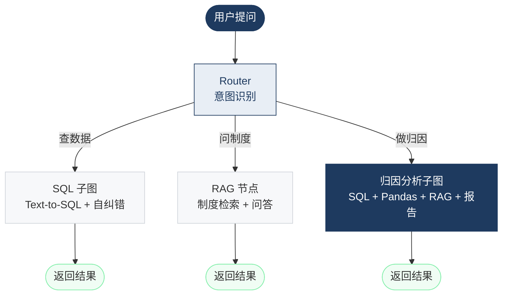
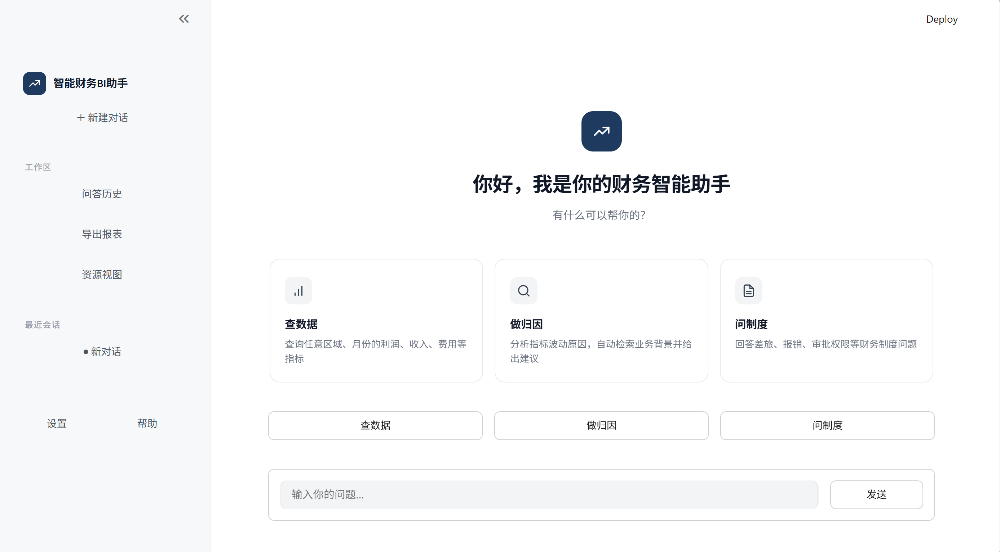
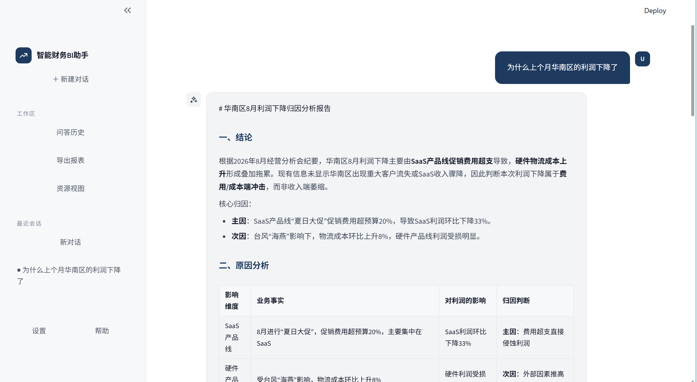
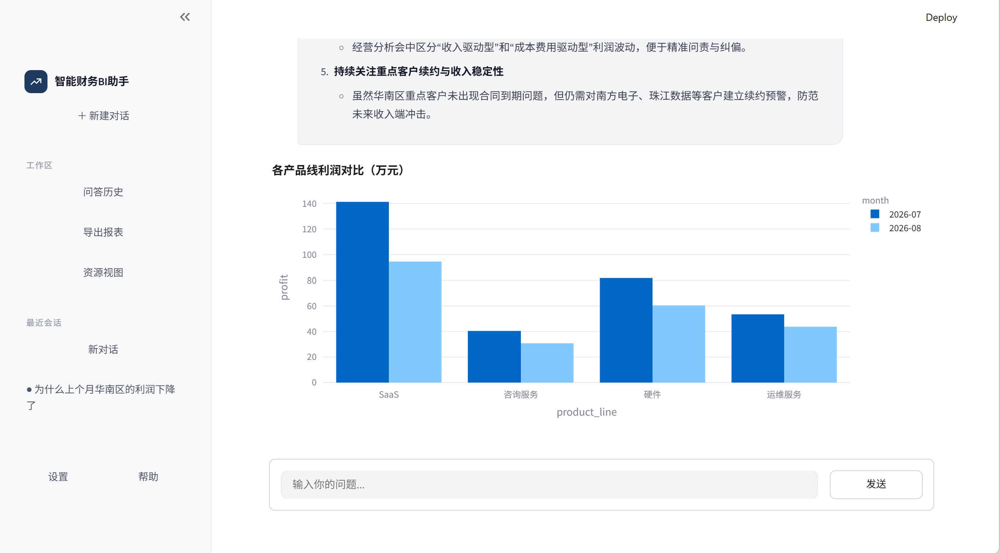
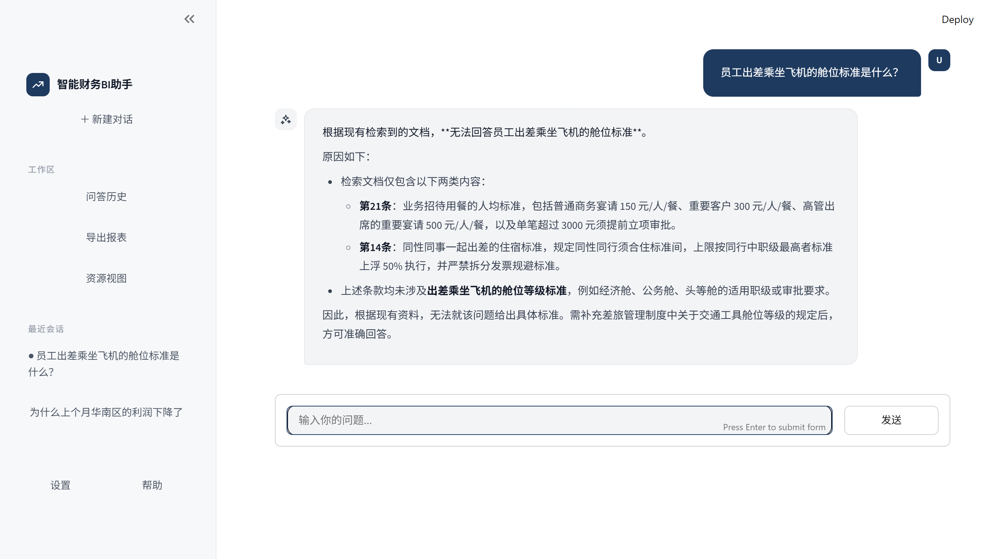
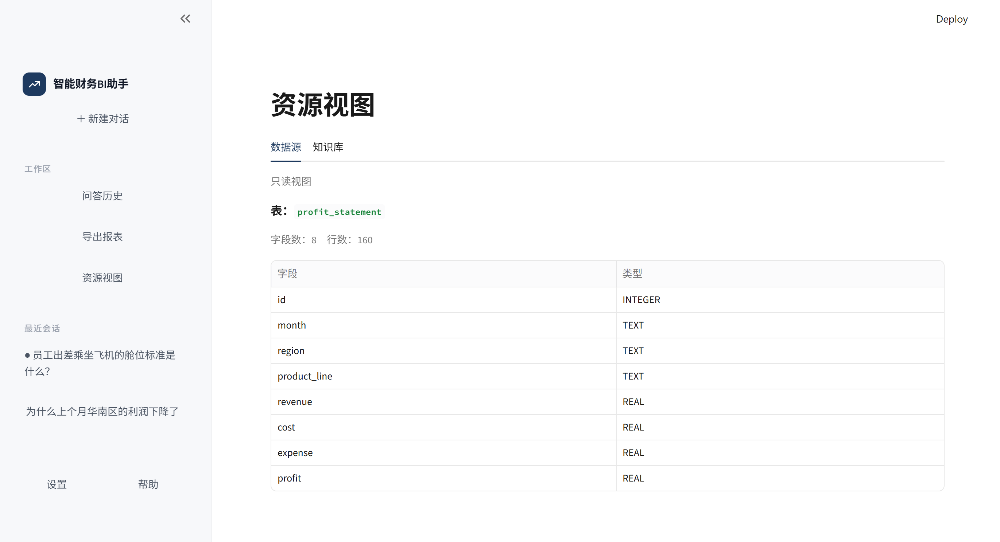
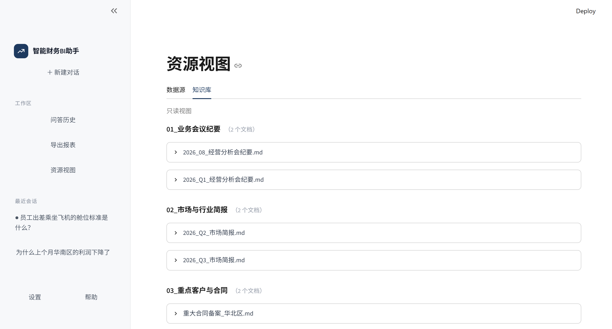
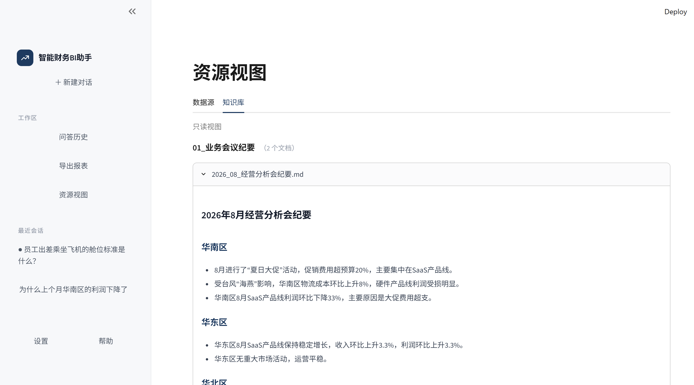

# 智能财务 BI 助手（Financial BI Assistant）


## 一、项目背景
财务工作中，从"数据"到"洞察"的链路极其低效：查数依赖 IT 提需求，问制度靠翻手册，做归因靠人工复盘 Excel。企业有大量结构化数据（利润表、费用明细）和非结构化知识（经营会纪要、制度文档），但二者割裂，无法支撑"用自然语言直接拿到洞察"。

大模型带来了机会，但直接接入财务场景会带来三个致命问题：**SQL 幻觉、结论不可溯源、无法处理多步归因流程**。

本项目用 **LangGraph** 构建一个可对话的财务 BI 助手，面向**财务 BP、管理层、财务共享中心**三类用户，覆盖**查数据、问制度、做归因**三类核心场景。核心定位不是"聊天机器人"，而是**可溯源、能纠错、有业务背景的财务分析 Agent**。


## 二、核心功能
### 2.1 查数据
用自然语言查询财务数据库，自动生成 SQL 并返回结果。内置 SQL 自纠错机制，执行报错时自动重写，保证数据准确性。

### 2.2 问制度
覆盖 50+ 条财务制度（差旅、招待、审批、发票等），支持自然语言问答。系统严格基于检索到的制度文档作答，无依据时明确拒答，避免编造。

### 2.3 做归因 ⭐核心亮点
输入"为什么某指标下降"，系统自动完成：查询数据 → 计算环比 → 检索业务背景 → 生成归因报告。报告引用真实业务事实（如"夏日大促"、"台风物流"），支持跨区域对照排除，并自动生成可视化图表。

### 2.4 多会话管理
支持新建、切换、标题自动生成。每个会话独立上下文，互不干扰。

### 2.5 资源视图
只读查看数据源表结构与知识库文档，支持点击展开阅读全文。用户只需要"知道有什么"，不需要修改。

## 三、技术栈

| 层级 | 技术 |
| :--- | :--- |
| **Agent 框架** | LangGraph（主图 + 三子图） |
| **LLM 框架** | LangChain |
| **大语言模型** | DeepSeek Chat |
| **Embedding** | SiliconFlow BAAI/bge-m3 |
| **向量库** | ChromaDB |
| **数据库** | SQLite |
| **数据处理** | Pandas |
| **图表** | Plotly |
| **前端** | Streamlit |
| **语言** | Python 3.11 |

## 四、系统架构图
### 主图 + 三子图


### 归因分析子图（核心）


### 状态管理
通过 `AgentState` 统一管理：

```python
class AgentState(TypedDict):
    messages: Annotated[list, add_messages]
    intent: Literal["查数据", "问制度", "做归因"]
    generated_sql: str
    query_result: str
    analysis_summary: str
    business_context: str
    chart_json: str
    final_answer: str
```


## 五、项目结构
```
Financial_BI_Agent/
├── data/
│   ├── financial.db                    # SQLite 数据库（160 条财务数据）
│   ├── chroma_db/                      # ChromaDB 向量库
│   └── knowledge_base/                 # 知识库（分类管理）
│       ├── 01_业务会议纪要/
│       ├── 02_市场与行业简报/
│       ├── 03_重点客户与合同/
│       └── 04_财务制度手册/
├── src/
│   ├── app.py                          # Streamlit 前端入口
│   ├── graph.py                        # LangGraph 主图 + 子图
│   ├── state.py                        # AgentState 定义
│   ├── llm.py                          # LLM 初始化
│   ├── i18n.py                         # 中英文文案
│   └── nodes/                          # 节点函数
│       ├── router.py                   # 意图识别
│       ├── sql_agent.py                # SQL 生成/执行/回答
│       ├── rag_agent.py                # 归因 RAG 检索
│       ├── rag_only_agent.py           # 问制度 RAG
│       └── attribution.py              # 数据分析 + 图表 + 归因生成
├── init_db.py                          # 数据库初始化
├── init_vectorstore.py                 # 向量库初始化
├── requirements.txt
├── .env.example
└── README.md
```

## 六、快速开始
### 1. 克隆项目

```bash
git clone https://github.com/你的用户名/Financial_BI_Agent.git
cd Financial_BI_Agent
```

### 2. 安装依赖

```bash
pip install -r requirements.txt
```

### 3. 配置环境变量

复制 `.env.example` 为 `.env`，填入你的 API Key：

```env
DEEPSEEK_API_KEY=sk-xxx
DEEPSEEK_BASE_URL=https://api.deepseek.com/v1
SILICONFLOW_API_KEY=sk-xxx
SILICONFLOW_BASE_URL=https://api.siliconflow.cn/v1
```
### 4. 初始化数据库和向量库

```bash
python init_db.py
python init_vectorstore.py
```

### 5. 启动应用

```bash
streamlit run src/app.py
```

浏览器打开 `http://localhost:8501` 即可使用。

---

## 七、演示截图
### 1. 欢迎页


### 2. 归因分析（含图表）



### 3. 问制度


### 4. 资源视图





---

## 项目亮点

1. **主图 + 三子图架构**：职责单一、状态隔离、可独立测试。
2. **SQL 自纠错循环**：条件边 + 重试计数器，防止死循环。
3. **RAG 自适应切分**：制度按标题切、业务按语义切，检索精度大幅提升。
4. **关键词过滤 + 语义排序**：解决"华南区" vs "华中区"的语义串扰。
5. **多会话状态管理**：支持新建、切换、标题自动生成。
6. **中英双语**：i18n 字典 + session_state 驱动。
7. **图表可视化**：Plotly 柱状图嵌入归因报告。

---

## 数据规模

- **数据库**：160 条记录，覆盖 8 个月 × 5 大区 × 4 条产品线
- **知识库**：7 个文档，分为 4 大类
- **制度手册**：50+ 条财务规则

---

## 后续规划

- [ ] Human-in-the-loop（人工审批）
- [ ] 会话删除 / 重命名
- [ ] 知识库上传功能
- [ ] PDF 报告导出
- [ ] 更多图表类型（折线图、饼图）
- [ ] 接入更多数据源（MySQL / PostgreSQL）

---


